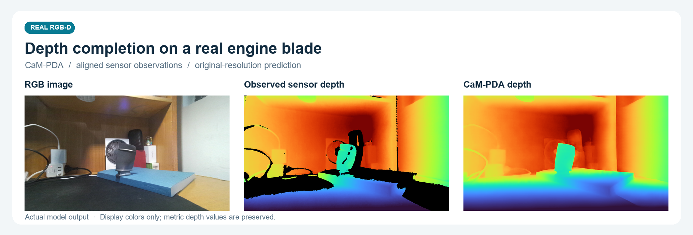
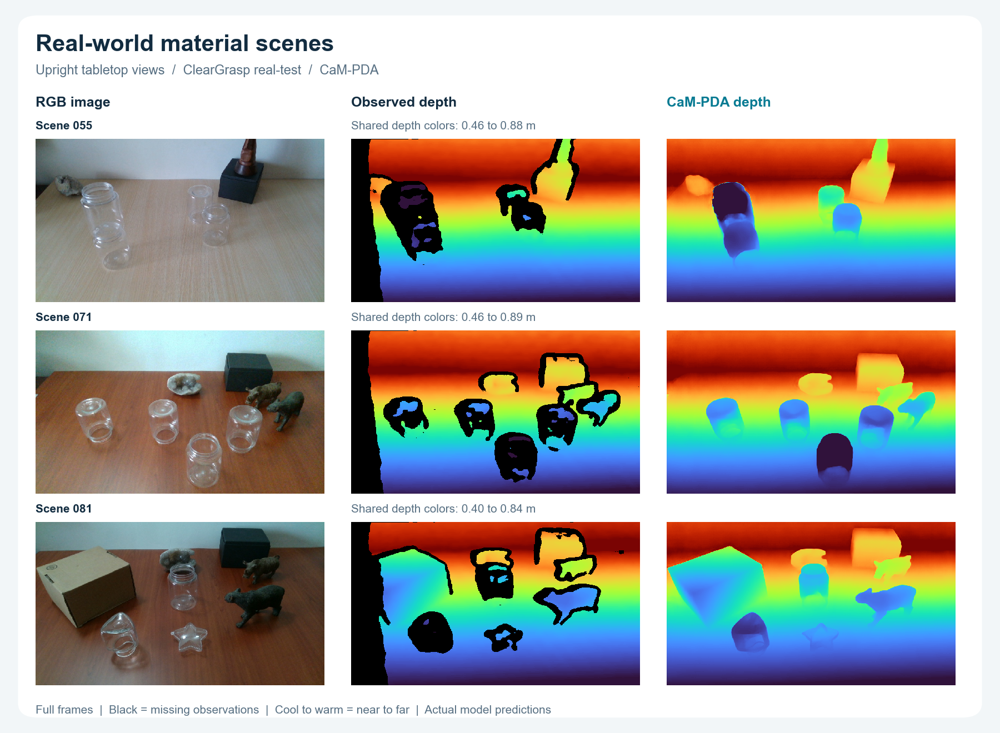

# CaM-PDA

**Turn RGB-D images into dense metric depth maps and colored point clouds.**

Python · Windows & Linux · Local processing

[简体中文](README.zh-CN.md) · [Installation](docs/INSTALL.md) · [Python API](docs/API.md) · [Architecture](docs/ARCHITECTURE.md) · [Results](benchmarks/README.md)



CaM-PDA combines balanced confidence screening with three specialist experts for reflective regions, non-flat geometry and depth edges. It builds on [Prior Depth Anything](https://github.com/SpatialVision/Prior-Depth-Anything) to complete depth from a color image and aligned sensor measurements.

**Run the program, enter your file paths when prompted, and choose where to save the results.** You can also start with an included example. Everything runs on your computer.

## What you get

| Dense depth | Colored point clouds | A simple Python workflow |
|---|---|---|
| Full-resolution depth in metres, plus a color preview | Calibrated `.ply` output for tools such as CloudCompare | Runtime path prompts, English / 中文, remembered output and model folders |

## Get started

Use **Python 3.10–3.12** on Windows or Linux. Download this repository with **Code → Download ZIP**, or clone it:

```console
git clone https://github.com/emp1y-fs/CaM-PDA.git
cd CaM-PDA
```

Install a compatible PyTorch build, then CaM-PDA. For the validated NVIDIA CUDA configuration:

```console
python -m pip install torch==2.7.1 --index-url https://download.pytorch.org/whl/cu128
python -m pip install .
python run.py
```

[Installation instructions](docs/INSTALL.md) cover isolated environments, CPU installation and model files. The two weights occupy about **0.8 GB**; the program lets you choose their storage folder or select existing files.

### 1. Choose your input

After starting `python run.py`, choose English or 中文, then:

```text
How would you like to start?
  1  Try an included example
  2  Enter my data paths
  0  Exit
```

Choose **1** to try the engine-blade scene. Choose **2** to enter the paths to your RGB image and observed depth. The program then asks for camera calibration, the result folder and model locations. Paths with spaces and pasted quotation marks are supported.

**You enter paths while the program is running. No Python source changes are needed.** After installation, `cam-pda` and `python -m cam_pda` start the same program.

### 2. Provide aligned RGB-D

| Input | Supported format |
|---|---|
| Color image | RGB image such as PNG or JPEG |
| Observed depth | A 2D floating-point `.npy` in metres, or a single-channel integer `.png` with its units specified |
| Camera calibration | Optional JSON with `fx`, `fy`, `cx`, `cy`, `width`, `height`; needed for a point cloud |

RGB and depth must be registered to the same image grid. Zero depth means a missing observation. Supply original sensor values rather than a colorized depth preview. A photo alone does not provide the metric measurements required by this method.

For another camera, use its calibration. With no calibration, CaM-PDA exports depth maps. With calibration, you can also choose an additional view of the same static scene; the included blade case provides a reference view.

### 3. Find your results

Each run creates a new folder inside your chosen location, so previous results remain intact:

```text
your_output_folder/
└── 20260907-220000_rgb_a1b2c3d4/
    ├── rgb.png              Input color image
    ├── depth_color.png      Completed-depth preview
    ├── depth_m.npy          Full-precision depth in metres
    ├── depth_mm.png         Millimetre PNG, when representable
    ├── point_cloud.ply      Colored point cloud, with calibration
    ├── accepted_mask.png    Accepted sensor observations
    └── metadata.json        Units, camera and run information
```

Point clouds use metres, with x right, y down and z forward. Numerical depth is saved without smoothing or geometric postprocessing.

## More depth examples



These are actual outputs from three runnable ClearGrasp real-test examples, chosen for natural upright viewpoints and clearly interpretable completion. Every panel shows the complete original frame. Each row uses a shared depth color range; black marks missing observations. No image rotation, numerical smoothing or geometric postprocessing is applied.

These selected illustrations are separate from the unchanged benchmark measurements below and remain excluded from training. The original DREDS examples are also retained. See [gallery details, selection and example IDs](docs/GALLERY.md) and [image provenance](assets/preview_provenance.json). The real blade scene above is a qualitative example without ground-truth depth.

## Recorded evaluation

Full-image **AbsRel ↓** on fixed held-out inputs:

| Method | DREDS-CatNovel · 110 frames | NYUv2 · 654 frames | ICL-NUIM · 80 frames |
|---|---:|---:|---:|
| **CaM-PDA** | **0.014226** | 0.023305 | **0.009010** |
| Official PDA | 0.030987 | 0.054981 | 0.067776 |
| OMNI-DC v1.1 | 0.035454 | **0.016802** | — |
| IP-Basic | 0.078946 | 0.031725 | — |
| Marigold-DC · 10 steps | 0.096877 | 0.059145 | — |

CaM-PDA improves over official PDA across these evaluated sets. OMNI-DC achieves lower full-image error on NYUv2. Regional trade-offs and all recorded methods are available in the [complete results and protocols](benchmarks/README.md). Preview images illustrate behavior and are separate from these aggregate measurements.

## Python API

For integration into another Python application:

```python
from cam_pda import run_from_paths

result_folder = run_from_paths(
    rgb_path="my_scene/rgb.png",
    depth_path="my_scene/sensor_depth.npy",
    camera_path="my_scene/camera.json",
    output_dir="results",
)
```

The interactive program is the easiest way to enter paths at runtime. The [API guide](docs/API.md) also covers array inputs, command-line automation, fixed example sampling and optional reference refinement.

## Learn more

- [Model card](docs/MODEL_CARD.md): checkpoint identity, intended use and known limits.
- [Architecture](docs/ARCHITECTURE.md): confidence screening, three conditions and R/N/E experts.
- [Training](docs/TRAINING.md): data provenance, expert supervision and evaluation separation.
- [Reproducibility](docs/REPRODUCIBILITY.md): Windows/Linux verification and numerical differences.

## Acknowledgements and terms

Built on [Prior Depth Anything](https://github.com/SpatialVision/Prior-Depth-Anything), [Depth Anything V2](https://github.com/DepthAnything/Depth-Anything-V2) and DINOv2. Upstream notices are preserved in [licenses](licenses/README.md). ViT-B weights and DREDS data carry **CC BY-NC 4.0** terms.

The repository currently requires access while release review is completed. Public licensing for new CaM-PDA code and author-owned examples is pending; existing upstream terms continue to apply. Publication and citation metadata will be added when available.
