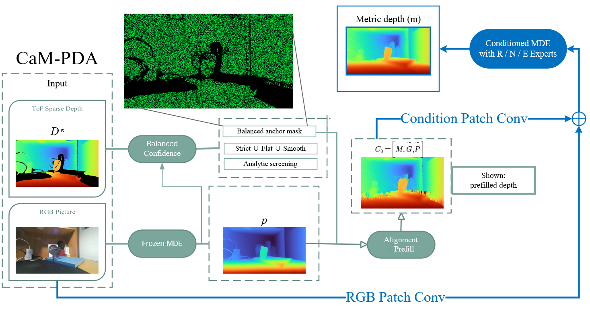
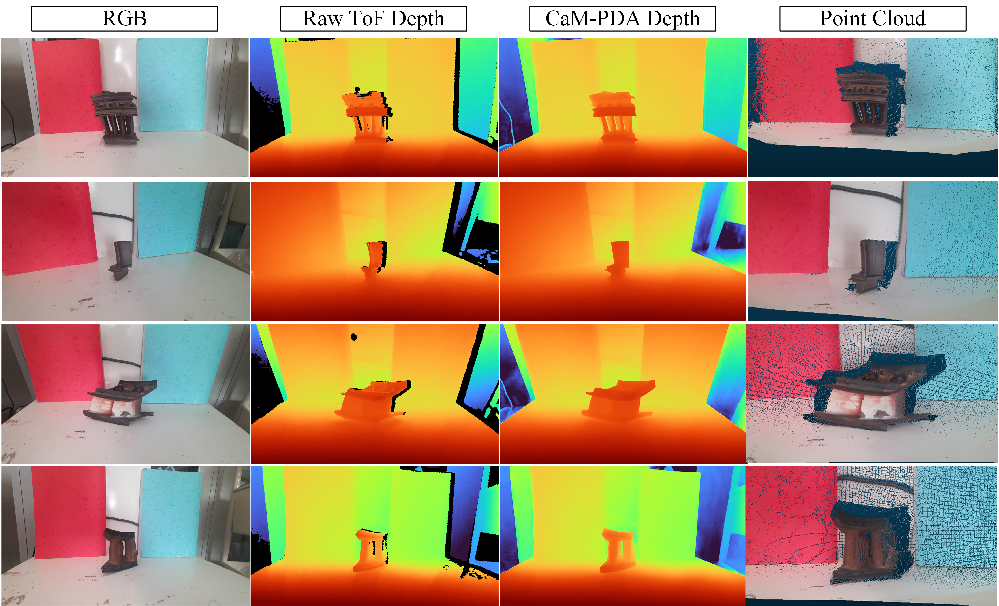

# CaM-PDA

**Align visual depth with real sensor measurements. Recover dense metric depth from RGB-D.**

Python · Windows & Linux · Single-frame inference

[Quick start](#quick-start) · [Test our weights](#test-the-released-weights-with-one-command) · [Use your data](#3-run-your-own-data) · [简体中文](README.zh-CN.md) · [Install](docs/INSTALL.md) · [Data & downloads](docs/DATASETS.md) · [Reproduce](docs/REPRODUCIBILITY.md) · [API](docs/API.md)

## Quick start

Run CaM-PDA in a Python terminal. **Choose your input files and save locations after the program starts; no source-code edits are needed.** The supplied examples include RGB, measured depth and calibration, so they are a convenient first run.

### 1. Get the code and install

Use an existing **Python 3.10–3.12** environment on Windows or Linux. In a terminal, open the folder where you want to keep the project:

```console
git clone https://github.com/emp1y-fs/CaM-PDA.git
cd CaM-PDA
```

Alternatively, select **Code → Download ZIP** on this page, extract it, and open a terminal in the extracted folder.

For an **NVIDIA GPU with a compatible driver**, install:

```console
python -m pip install torch==2.7.1 --index-url https://download.pytorch.org/whl/cu128
python -m pip install ".[benchmark]"
```

For **CPU**, use these commands instead; inference will be slower:

```console
python -m pip install torch==2.7.1 --index-url https://download.pytorch.org/whl/cpu
python -m pip install ".[benchmark]"
```

No separate CUDA Toolkit installation or Visual Studio build is required. For an isolated environment, see [environment setup](docs/INSTALL.md#1-choose-a-python-environment).

### 2. Start CaM-PDA

From the project folder, run:

```console
python run.py
```

After installation, `cam-pda` or `python -m cam_pda` also starts the same program.

### 3. Run your own data

Prepare one RGB image, its registered numerical depth, and your camera calibration JSON. The example below assumes your files are `D:\RGBD\scene01\rgb.png`, `D:\RGBD\scene01\sensor_depth.npy`, and `D:\RGBD\scene01\camera.json`. **Replace these with your own full file paths.** The output path is a folder; the input and weight paths are individual files.

For this walkthrough, first download the two model files and keep them in a folder of your choice:

- **`cam_pda_v1.pt`**: [CaM-PDA model release](https://github.com/emp1y-fs/CaM-PDA/releases/tag/v0.1.0).
- **`depth_anything_v2_vitb.pth`**: [PDA model host](https://huggingface.co/Rain729/Prior-Depth-Anything/resolve/main/depth_anything_v2_vitb.pth).

After `python run.py` starts, enter the following answers **one at a time and press Enter after each**. These are responses inside CaM-PDA, not commands to paste into PowerShell or a Python source file. The menu labels are shown below; their defaults may reflect your last run.

| When CaM-PDA asks… | Enter this (Windows example) |
|---|---|
| Language / 语言 | `1` for English, or `2` for Chinese |
| How would you like to start? | **`2` — Enter my data paths** |
| RGB image path | `D:\RGBD\scene01\rgb.png` |
| Sensor depth path (.npy or integer .png) | `D:\RGBD\scene01\sensor_depth.npy` |
| Camera JSON path (Enter: depth only) | `D:\RGBD\scene01\camera.json` |
| Save results in folder | **`D:\RGBD\results`** |
| Model files | **`2` — Use two existing weight files** |
| CaM-PDA weight file | `D:\CaM-PDA\weights\cam_pda_v1.pt` |
| Monocular prior weight file | `D:\CaM-PDA\weights\depth_anything_v2_vitb.pth` |
| Compute device | `1` for automatic NVIDIA GPU/CPU selection, or `2` for CPU |

On Linux, use the same choices with your Linux paths, for example `/home/you/RGBD/scene01/rgb.png`, `/home/you/RGBD/scene01/sensor_depth.npy`, `/home/you/RGBD/scene01/camera.json`, `/home/you/RGBD/results`, and model files under `/home/you/CaM-PDA/weights/`. Paths containing spaces can be pasted with surrounding quotes.

**Where do the results go?** With the Windows example above, the program creates a new folder such as `D:\RGBD\results\<timestamp>_rgb_<id>\`. It prints that full location when processing finishes. The chosen output folder does not change the output filenames or formats. Storage preferences are remembered; type a different path at the same prompt on the next run to change them.

**Depth and calibration:** RGB and measured depth must have the same resolution and already share the same pixel grid. `.npy` depth must be a two-dimensional floating-point array in **metres**. For a single-channel integer depth `.png`, an extra unit prompt appears immediately after its path: choose **1 — Millimetres** only if the file actually stores millimetres. Zero denotes missing depth; a colorized preview is not numerical depth. Camera JSON must contain your calibrated `fx`, `fy`, `cx`, `cy`, `width`, and `height`. Press Enter without a camera path to produce depth maps only; point-cloud export requires calibration.

**Prefer automatic weight download?** At **Model files**, choose **1 — Use a model folder; download missing weights**, then enter, for example, `D:\CaM-PDA\weights` or `/home/you/CaM-PDA/weights`. Both files total about **0.8 GB**. During private review, the CaM-PDA download requires repository access: use manual browser download, or your authorized GitHub username with an existing Git Credential Manager sign-in. Once the release is public, leave the username blank.

**Try an included example instead:** choose **1 — Try an included example**, select `blade32` or `engine_component_01`–`engine_component_04` from the displayed list, then provide the output folder and model paths as above. The example supplies its RGB, measured depth and calibration automatically.

### 4. Open the results

When processing finishes, the terminal prints the result folder. Each run creates a new subfolder under your selected save directory:

```text
result_folder/
├── rgb.png              Input RGB
├── depth_color.png      Depth preview
├── depth_m.npy          Float32 depth in metres
├── depth_mm.png         Rounded millimetre depth, when representable
├── point_cloud.ply      Colored point cloud, when calibration is supplied
├── accepted_mask.png    Retained sensor observations
└── metadata.json        Calibration, units and prediction settings
```

Open **`depth_color.png`** in an image viewer and **`point_cloud.ply`** in CloudCompare or another PLY viewer. Use **`depth_m.npy`** for numerical work. Point-cloud coordinates are in metres: x right, y down, z forward. Export preserves the predicted depth values.

## Test the released weights with one command

After the installation above, **run this from the cloned or extracted CaM-PDA folder**:

```console
python reproduce.py --root ./cam_pda_test
```

The program downloads the fixed test data and both weights, checks their SHA256 values, evaluates **all 844 frames**, and saves scores and predicted depth maps. No manual extraction, dataset selection, or source-code editing is needed. `--root` controls **all** download, data, weight and output locations. On Windows, for example: `python reproduce.py --root "D:/CaM-PDA-test"`; on Linux: `python reproduce.py --root /home/you/CaM-PDA-test`.

| Test subset | Frames | Automatic download |
|---|---:|---|
| DREDS-CatNovel | 110 | [Prepared inputs and reference masks, 30.2 MB](https://github.com/emp1y-fs/CaM-PDA/releases/download/paper-tests-v1/cam_pda_dreds110_v1.zip) |
| NYUv2 | 654 | [Official labeled MAT, 2.97 GB](https://horatio.cs.nyu.edu/mit/silberman/nyu_depth_v2/nyu_depth_v2_labeled.mat) + [frozen protocol masks, 15.8 MB](https://github.com/emp1y-fs/CaM-PDA/releases/download/paper-tests-v1/cam_pda_nyu654_masks_v1.zip); converted automatically |
| ICL-NUIM | 80 | [Prepared inputs and reference masks, 28.0 MB](https://github.com/emp1y-fs/CaM-PDA/releases/download/paper-tests-v1/cam_pda_icl80_v1.zip) |

The first full run downloads about **3.83 GB including both weights**. NYUv2's official file contains all labeled images; the converter selects only the 654 official test frames. We do not mirror its RGB or depth arrays. The prepared test records total about 375 MB. Allow approximately **6 GB** for downloads, prepared records and predicted depth maps. Verified files are reused; interrupted downloads resume when you rerun the command. NVIDIA CUDA is recommended for the full benchmark; CPU evaluation is supported but much slower.

**Results:** the terminal prints a score table and the full output path. Open `cam_pda_test/results/<run>/results.md` for a readable summary, `summary.csv` for aggregate and regional metrics, and `per_frame.csv` for every frame. Under `predictions/`, folders named by each manifest frame ID contain `depth_m.npy` (metres) and `depth_color.png`. New runs receive separate result folders. Benchmark records do not include calibrated intrinsics, so this command exports depth maps and evaluation results; use the capture workflow above for calibrated point clouds.

To start with the smaller 80-frame ICL set, use `python reproduce.py --root ./cam_pda_test --dataset icl80`. Other choices are `dreds110` and `nyu654`. Use `--prepare-only` to download without evaluating or `--metrics-only` to skip saving depth maps. Existing weights or an existing NYUv2 MAT can also be reused; see [benchmark options](docs/REPRODUCIBILITY.md#one-command-benchmark).

**Private review:** downloads require an account granted access to this repository. The command uses an existing Git Credential Manager sign-in or `GH_TOKEN`/`GITHUB_TOKEN`; use `--github-user YOUR_GITHUB_NAME` to select an account. No credential is written to the results. Once the repository and releases are public, the same command works without GitHub sign-in. If you installed an older package without benchmark support, run `python -m pip install ".[benchmark]"` once first.


CaM-PDA extends [Prior Depth Anything](https://github.com/SpatialVision/Prior-Depth-Anything) with a **balanced-confidence front end** and an **expert matrix**. The confidence front end selects sensor observations for aligning the visual depth prior with measured depth. The expert matrix introduces independently gated reflective, non-flat and edge experts into the conditioned network to predict dense metric depth.

**Input:** one RGB image and its registered sensor depth. **Output:** a depth preview, numerical metric depth and, with camera calibration, a colored point cloud. RGB and sensor depth must already share the same pixel grid; the alignment inside CaM-PDA recovers depth scale and structure, not camera-to-camera image registration.

## Overall workflow



## Engine components



These additional engine-component captures appear in Section 5 of the manuscript. They were acquired in a **relatively uncluttered tabletop setting**. Each row is processed independently from one RGB-D frame. The examples illustrate completion of missing sensor depth and the resulting surface structure; no reference geometry is available for a quantitative accuracy claim.

Choose `engine_component_01` through `engine_component_04` in the program to reproduce the four rows. The original RGB, sensor depth, calibration and sampling seed are included in both the source checkout and installed package. [Example details and provenance](docs/ENGINE_COMPONENTS.md).

Additional [real material examples](docs/GALLERY.md) are available in the source checkout.

## Reproduction and implementation

- [Reproduction guide](docs/REPRODUCIBILITY.md): installation → weights → examples → evaluation → training records.
- [Dataset sources](docs/DATASETS.md): original download locations, exact sample selections and required files.
- [Training](docs/TRAINING.md): both adaptation stages, expert supervision and checkpoint selection.
- [Architecture](docs/ARCHITECTURE.md): balanced confidence, three conditioning channels and independent R/N/E experts.
- [Python API](docs/API.md): file and array interfaces for integration.
- [Model card](docs/MODEL_CARD.md): intended use and limitations.

The released weights are the manuscript's CaM-PDA checkpoint. Application updates do not retrain the model.

## Acknowledgements and terms

Built on [Prior Depth Anything](https://github.com/SpatialVision/Prior-Depth-Anything), [Depth Anything V2](https://github.com/DepthAnything/Depth-Anything-V2) and DINOv2. [Upstream notices and data terms](licenses/README.md) apply; ViT-B weights and DREDS data carry **CC BY-NC 4.0** terms.

This repository is private during author review. Licensing for new CaM-PDA code and author-owned examples is pending; no additional redistribution rights are granted by their inclusion here.
