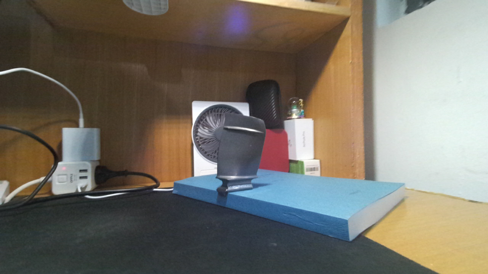

# CaM-PDA

**Confidence-aware metric depth completion with independent reflective, non-flat and edge experts.**

[中文说明](README.zh-CN.md) · [Installation](docs/INSTALL.md) · [Python API](docs/API.md) · [Architecture](docs/ARCHITECTURE.md) · [Training and evaluation](docs/TRAINING.md)

CaM-PDA combines balanced confidence screening with the native three-channel conditioning of [Prior Depth Anything](https://github.com/SpatialVision/Prior-Depth-Anything). It accepts an RGB image and aligned sensor depth, completes a dense metric depth map, and exports a colored point cloud when camera calibration is provided.

This repository contains the retained CaM-PDA model (development identifier **T1 / 026 step 600**). Continued-training T2/T3 candidates do not replace this checkpoint. The current repository is private for author review.

Windows native CUDA and Linux CUDA/CPU paths are tested. The Linux port exactly reproduces the retained frame-32 result; default Windows BF16 attention kernels produce small numerical differences. See [cross-platform verification](docs/REPRODUCIBILITY.md).



## Get started

Python 3.10–3.12; Windows or Linux. Install an appropriate [PyTorch wheel](https://pytorch.org/get-started/previous-versions/) first. The validated CUDA configuration uses PyTorch 2.7.1 + CUDA 12.8.

```console
git clone https://github.com/emp1y-fs/CaM-PDA.git
cd CaM-PDA
python -m venv .venv
```

Activate `.venv` as described in [INSTALL.md](docs/INSTALL.md), then:

```console
python -m pip install torch==2.7.1 --index-url https://download.pytorch.org/whl/cu128
python -m pip install ".[web]"
cam-pda download --github-user emp1y-fs
cam-pda example examples/blade32 --output outputs/blade32
cam-pda serve
```

Open **http://127.0.0.1:7860** to use an example or upload RGB, aligned sensor depth and calibration. The demo runs locally. The private release requires access to this repository; `--github-user` reads the selected account from Git Credential Manager without writing its credential into this project. See installation alternatives for CPU and manually downloaded weights.

## Your own RGB-D

```console
cam-pda infer --rgb photo.png --depth sensor.png --depth-scale 0.001 --camera camera.json --output outputs/my_scene
```

Depth PNG must contain integer sensor values, not a colorized depth preview. `0.001` converts millimetres to metres. Alternatively, use a 2D float32 NPY in metres. RGB and depth must already be registered to the same image grid; missing observations are zero. A photo alone does not provide the sensor anchors needed by this model.

Camera JSON contains `fx`, `fy`, `cx`, `cy`, `width`, and `height`. Omitting `--camera` exports depth without a point cloud; the program never assumes another camera's focal length.

Outputs include full-precision `depth_m.npy`, `depth_color.png`, `accepted_mask.png`, `metadata.json`, and calibrated `point_cloud.ply`. `depth_mm.png` is included when positive depths fit into uint16 millimetres. PLY coordinates use metres, with x right, y down and z forward.

## Python

```python
from cam_pda import CaMPDA, CameraIntrinsics
from cam_pda.io import read_rgb, read_depth, export_result

model = CaMPDA(device="auto")
rgb = read_rgb("examples/blade32/rgb.png")
depth = read_depth("examples/blade32/sensor_depth.npy")
camera = CameraIntrinsics.from_json("examples/blade32/camera.json")
result = model.predict(rgb, depth, seed=0)
export_result(result, rgb, "outputs/python_example", camera)
```

The same package supports optional guarded two-view refinement through `predict_multiview` or `--references examples/blade20`. This estimates pose from raw RGB-D, reprojects predicted depth, and falls back to the exact single-view output if registration is unsuitable. It is depth-domain refinement, not a multiview neural network.

## Recorded paper results

Full-image AbsRel ↓ on fixed, held-out inputs; these are archived measurements, not scores inferred from the examples.

| Method | DREDS-CatNovel (110) | NYUv2 (654) | ICL-NUIM (80) |
|---|---:|---:|---:|
| CaM-PDA | **0.014226** | 0.023305 | **0.009010** |
| Official PDA | 0.030987 | 0.054981 | 0.067776 |
| OMNI-DC v1.1 | 0.035454 | **0.016802** | — |
| IP-Basic | 0.078946 | 0.031725 | — |
| Marigold-DC (10 steps) | 0.096877 | 0.059145 | — |

CaM-PDA reduces full-image error relative to official PDA across these three evaluated sets. OMNI-DC has lower full-image error on NYUv2; regional and metric-dependent trade-offs remain. See [all recorded metrics and protocol boundaries](benchmarks/README.md), including additional methods and the different-input VGGT context. No ground-truth alignment or test-driven output clipping is applied.

## Examples and resources

- `examples/blade32`: the author-captured real blade frame, aligned sensor depth and camera calibration.
- `examples/blade20`: a reference selected by raw RGB-D registration quality; `blade30` also demonstrates a small-baseline fallback.
- Three DREDS-CatNovel test examples, selected by first/middle/last manifest position. They carry frozen sampling masks and original seeds. Their source cache does not seal transformed camera calibration, so these examples export depth only.
- `benchmarks/paper_metrics.csv`: recorded full and regional results against external algorithms.
- `src/cam_pda/resources/models.json`: SHA256-verified model identities. Large weights are release assets, separate from Git source history.

Examples are inference demonstrations, not a training dataset. Follow each example's provenance and license. The DREDS examples remain excluded from training.

## Attribution and release terms

CaM-PDA builds on [Prior Depth Anything](https://github.com/SpatialVision/Prior-Depth-Anything), [Depth Anything V2](https://github.com/DepthAnything/Depth-Anything-V2), and DINOv2. Upstream notices are preserved in the source and [licenses](licenses/README.md). The ViT-B Depth Anything V2 weights and DREDS data carry **CC BY-NC 4.0** terms; do not interpret the upstream code's Apache license as unrestricted licensing of all weights and data.

The author has not yet selected a public license for the new CaM-PDA code and author-owned examples. This private review release grants no additional redistribution rights beyond the applicable upstream licenses. Citation and author metadata will be finalized with the manuscript; no publication identifier is invented here.
