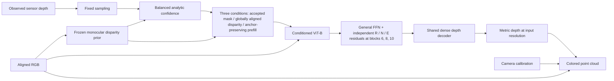

# Architecture

The retained confidence front end is an analytic local/global geometric rule. It is not the earlier convolution–Transformer confidence network. Its accepted anchors drive three native PDA conditions; no fourth confidence channel enters the model.

The general FFN remains active. Reflective, non-flat and edge specialists are rank-32 residual adapters in zero-based encoder blocks 6, 8 and 10. Each has an independent sigmoid gate with temperature 0.7 and a 0.5 activation threshold. Multiple specialists can operate on the same token; no top-1 competition is imposed. Router conditions use a detached FP32 softsign transform; the original condition projection receives the unchanged three-channel conditions.

The frozen monocular prior operates in FP32. On compatible CUDA hardware the fine prediction uses BF16, with the original TF32 policies restored around each call. CPU uses FP32. A global lock serializes the portions that change PyTorch numerical settings and alignment RNG state. Coarse and fine weights can be transferred sequentially to reduce peak GPU memory. KNN uses chunked `torch.cdist` and `topk` in Python/PyTorch, with no custom compiled neighbor-search dependency.

The inference checkpoint contains every retained model tensor and its architecture identity; optimizer state and local experiment paths were removed. Full state loading is strict, and both weight files are SHA256-verified. The external input/output contract is independent of the training cache structure.

## Package map

| Module | Responsibility |
|---|---|
| `pipeline.py` | Validated RGB-D inference and optional reference refinement |
| `confidence.py`, `conditions.py` | Frozen balanced selection and three-channel construction |
| `network.py` | ViT-B specialist residuals and routing |
| `_vendor/pda/` | Attributed PDA / Depth Anything backbone and depth alignment |
| `io.py` | Units, calibration, depth previews and binary PLY |
| `multiview.py` | Raw RGB-D registration and guarded depth reprojection |
| `weights.py` | Hash-verified acquisition and explicit model paths |
| `interactive.py`, `runner.py` | Runtime path prompts, remembered storage settings and isolated result folders |
| `cli.py`, `run.py` | Interactive launch and optional command-line automation |

This source release packages inference and records training provenance. It does not claim to provide a one-command replay of all historical training campaigns. The paper's matched ablations require the original frozen manifests and initialization chain; see [TRAINING.md](TRAINING.md).
