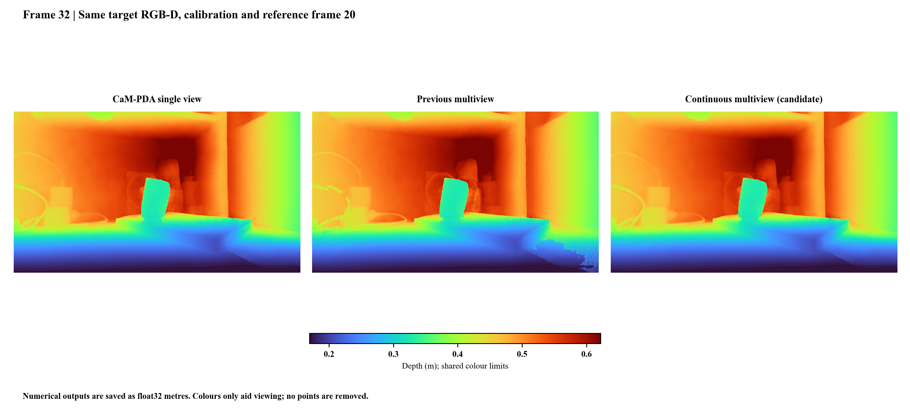

# Continuous multiview refinement

Choose an additional calibrated RGB-D view when running CaM-PDA. The program estimates the relative pose from RGB and sensor depth, then uses the reference prediction to make a continuous correction to the target prediction. The included blade32 example can use blade20 as its reference.

This optional step uses the same single-view model weights. It requires a static scene, overlapping views, aligned RGB-D and accurate camera intrinsics. It does not turn an uncalibrated photograph into a metric measurement.

## How it works

1. ORB matching, PnP and constrained ICP select one usable reference. Registration uses RGB and raw depth, without ground-truth poses.
2. Target-to-reference projection and bilinear sampling form candidate depth differences. Depth agreement, projection round trips and reference occlusion edges reject incompatible evidence; RGB differences also reduce its weight.
3. A weighted least-squares solve estimates a correction `delta` to the single-view depth. The objective balances the target prior, supported reference differences and neighboring correction differences. Neighbor weights decrease at existing depth and RGB boundaries.

The output is `single_view_depth + delta`. Regularization acts on the correction; it does not fit manually selected planes. Accepted sensor values are **not** written back into the final depth. Sensor depth only supports registration and identifies holes for the prior weight.

| Setting | Frozen value |
|---|---:|
| Depth agreement | 0.03 m + 0.01 × target depth |
| Round-trip projection error | Below 2 pixels |
| Reference relative depth-edge threshold | 0.015 |
| Correction smoothness | 64 × (image width / 640)² |
| Target prior weight: observed / hole | 1 / 0.5 |
| Total reference weight cap | 1 |
| Conjugate-gradient iteration limit | 200 |

The requested CG relative tolerance is `1e-5`. At the iteration limit, the implementation additionally checks the actual relative linear residual and accepts only values at most `1e-3`. Solver metadata distinguishes these cases. A failure of that acceptance check returns the original single-view output with a recorded reason. No eligible registration or no valid reference support also gives an exact single-view fallback.

## Recorded evaluation

The frozen ICL-NUIM temporal protocol contains 80 targets, with 76 refined and four exact fallbacks. Values are means of FP64 per-frame metrics; lower is better.

| Method | Full AbsRel | Full RMSE (m) | Hole AbsRel | Hole RMSE (m) |
|---|---:|---:|---:|---:|
| Single view | 0.009010 | 0.037344 | 0.034829 | 0.105865 |
| Previous hard fusion | 0.008806 | 0.047694 | **0.033168** | **0.105018** |
| Continuous correction | **0.008775** | **0.037023** | 0.034207 | 0.105424 |

Continuous correction offers modest full-image and hole-region improvements over single view while avoiding the previous increase in full-image RMSE. The previous method still has lower hole errors and full-image MAE in this evaluation. The new method is not uniformly superior across metrics or surfaces.

The fixed-pair control uses the **same 80 targets**, with a different reference policy. It gives full-image AbsRel/RMSE of 0.008774/0.037001 m for continuous correction. It is not a second independent set of 80 samples. [Complete metrics](../benchmarks/multiview_metrics.csv) retain both policies and all three measured regions.

Parameters were frozen following a 12-target development trajectory, before scoring this candidate on the paper trajectory. The old method's paper results had already been examined during development. These are known-scene trajectory checks, not a newly blinded unseen-scene study or evidence of statistical significance across independent scenes.

## Real engine-blade example

These are the recorded evaluation panels; the continuous method shown at right is the optional refinement in v0.3.0. All use frame32, reference20, native 1280×720 RGB-D, the same calibration and a shared depth color scale. The previous scatter-like changes beside the platform are reduced. Numerical arrays and all 921,600 projected points are retained.

The scene has no dense reference depth. Historical plane-region diagnostics improved on the wood wall and mouse pad relative to single view, but the white wall and platform were slightly worse. These checks describe shape consistency, not absolute dimensional accuracy. The real-frame solve reached its 200-step limit with relative linear residual 0.000644; it did not reach the requested `1e-5` tolerance.

## Output and API

Input paths are entered at runtime as before. See [the API guide](API.md#optional-multiview) for Python array and file interfaces. `metadata.json` records the selected registration, support-pixel count, changed-pixel count (`fused_pixels`), solver status, residual and 95th-percentile correction size. Regularization can change pixels outside direct reference support.

The public high-level API takes and returns depths in metres. The registration record retains millimetre translation; `multiview.refine_reference` converts a private copy to metres before calling the solver. Different NumPy/OpenCV/PyTorch versions can produce numerical differences across Windows and Linux. No cross-platform bitwise equivalence is claimed.
